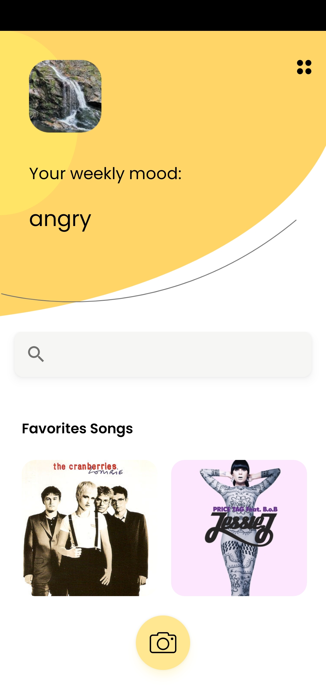
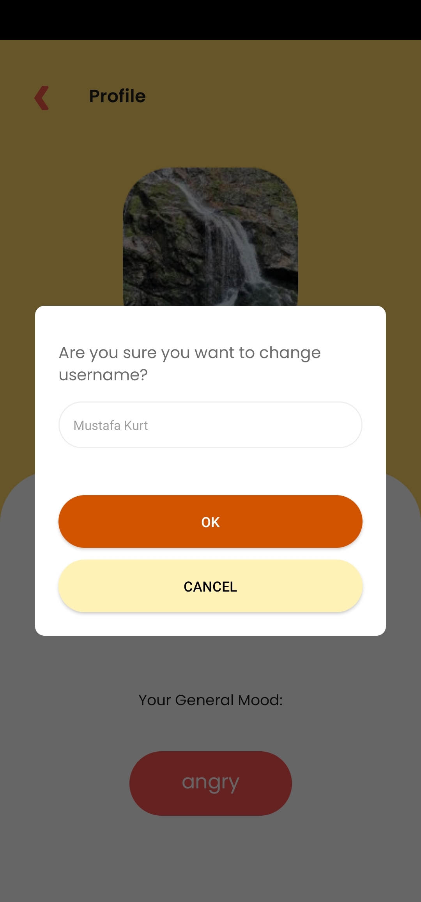

# Mood Chords

    

Mood Chords app is to demonstrate the mood of user to analyze user face detection  by  HUAWEI ML Kit and suggest music chords based on current emotion.
feature.

## Screenshots
</img>
</img>
</img>


## Introduction

Mood Chords is an android application that you can get the guitar chords for songs according to your mood. When people want to play the guitar, sometimes people don't know what you want to play. This project aims to propose a random song based on face analysis by taking a selfie. Musicians no longer have to think about which songs to play using this app. As long as the application is used, according to the analysis made, the general mood of the musician or monthly and weekly moods will be monitored. This app uses Face Detection feature of HMS ML Kit. And also, by using HMS Account Kit the app provides fast sign up/in.

## Which need of users are we addressing?
This project aims to propose a random song based on face analysis by taking a selfie. Musicians no longer have to think about which songs to play using this app. As long as the application is used, according to the analysis made, the general mood of the musician or monthly and weekly moods will be monitored.

## What are the most important usage scenarios?
- Taking selfie and get the emotion result of the image
- Getting a random song from database according the user’s face analysis emotion result
- Improving repertoire of musician

## User Profile
- Anyone who can play the guitar and wants to find guitar chords.


## About HUAWEI ML Kit

HUAWEI ML Kit allows your apps to easily leverage Huawei's long-term proven expertise in machine learning to support diverse artificial intelligence (AI) applications throughout a wide range of industries. Thanks to Huawei's technology accumulation, ML Kit provides diversified leading machine learning capabilities that are easy to use, helping you develop various AI apps. 


## About HUAWEI ML Kit Face Detection

The face detection service can detect the face contour, recognize facial features, and determine facial expressions for a person.
Face contour: Face detection can detect up to 855 face contour points to accurately locate face coordinates including face contour, eyebrows, eyes, nose, mouth, and ears, and identify the pitch, yaw, and roll angles of a face. Facial features: Face detection can detect seven facial features including the possibility of opening the left eye, possibility of opening the right eye, possibility of wearing glasses, gender possibility, possibility of wearing a hat, possibility of wearing a beard, and age. Facial expressions: Face detection can detect seven facial expressions, namely, smiling, neutral, anger, disgust, fear, sadness, and surprise. The face detection service supports static image detection, camera stream detection, and cross-frame face tracking. Multiple faces can be detected at a time. In addition, this service supports on-demand integration of face detection capabilities.

To discover more, visit: [Huawei ML Kit Guide](https://developer.huawei.com/consumer/en/doc/development/HMS-Guides/ml-face-intro-4)

## What You Will Need

**Hardware Requirements**
- A computer that can run Android Studio.
- An Android phone for debugging.

**Software Requirements**
- Android SDK package
- Android Studio 3.X
- HMS Core (APK) 4.X or later

## Getting Started

Mood Chords use HUAWEI services. In order to use them, you have to [create an app](https://developer.huawei.com/consumer/en/doc/distribution/app/agc-create_app) first. Before getting started, please [sign-up](https://id1.cloud.huawei.com/CAS/portal/userRegister/regbyemail.html?service=https%3A%2F%2Foauth-login1.cloud.huawei.com%2Foauth2%2Fv2%2Flogin%3Faccess_type%3Doffline%26client_id%3D6099200%26display%3Dpage%26flowID%3D6d751ab7-28c0-403c-a7a8-6fc07681a45d%26h%3D1603370512.3540%26lang%3Den-us%26redirect_uri%3Dhttps%253A%252F%252Fdeveloper.huawei.com%252Fconsumer%252Fen%252Flogin%252Fhtml%252FhandleLogin.html%26response_type%3Dcode%26scope%3Dopenid%2Bhttps%253A%252F%252Fwww.huawei.com%252Fauth%252Faccount%252Fcountry%2Bhttps%253A%252F%252Fwww.huawei.com%252Fauth%252Faccount%252Fbase.profile%26v%3D9f7b3af3ae56ae58c5cb23a5c1ff5af7d91720cea9a897be58cff23593e8c1ed&loginUrl=https%3A%2F%2Fid1.cloud.huawei.com%3A443%2FCAS%2Fportal%2FloginAuth.html&clientID=6099200&lang=en-us&display=page&loginChannel=89000060&reqClientType=89) for a HUAWEI developer account.

After creating the application, you need to [generate a signing certificate fingerprint](https://developer.huawei.com/consumer/en/codelab/HMSPreparation/index.html#3). Then you have to set this fingerprint to the application you created in AppGallery Connect.
- Go to "My Projects" in AppGallery Connect.
- Find your project from the project list and click the app on the project card.
- On the Project Setting page, set SHA-256 certificate fingerprint to the SHA-256 fingerprint you've generated.


## Using the Application

- Before you run the app, make sure that you have a working internet connection since the application uses Huawei Mobile Services. Otherwise, the app will display a "no connection" screen until you turn the internet on.
- Before you run the app, make sure that you have a Huawei Account since the application uses Huawei Account to sign-in. Otherwise, you can't sign-in.

When you first run the app, the onboarding screen welcomes you and introduces the app. When you get past this screen, it will not be shown if you close the app and reopen. After onboarding, the app continues to Login Screen to retrieve the information (username and profile picture) from Huawei Account (For this sign-in scenario, [Huawei Account Kit](https://developer.huawei.com/consumer/en/hms/huawei-accountkit) is used).

Once you sign-in, you will be redirected to home screen where you can see your profile picture and username which retrieved from Huawei Account kit, your weekly mood, search bar where you can search your all chords, favorite songs list which shows favorite songs and camera usage to take selfie which needed for face catch and mood analyzing. 
By clicking one of favorite song list item, app will redirected user to chord screen where user can see clicked song lyrics with chords.
On the top right of the main screen, you'll find a profile icon. You can tap this icon to open profile screen. You can change your profile photo by clicking retrieved profile picture, change your username by clicking retrieved username, switch language of the app and sign-out. Additionally, user can see general mood information bottom of this page.


## Screenshots

</img>
</img>
</img>
</img>
</img>
</img>
</img>
</img>
</img>
</img>
</img>
</img>
</img>
</img>
</img>


## Project Structure

Mood Chord  is designed with MVVM design pattern.

## Libraries

- Huawei Account Kit
- Huawei ML Kit - Face Detection
- Room DB
- View Binding
- Jetpack Navigation
- Kotlin Coroutines
- Material UI Design
- Shared Preferences
- Dagger Hilt
- View Pager
- Work Manager
- Glide
- Moshi

## Contributors
- Ali Osman ARSLAN
- Ismail Oguzhan AY
- Merve Nur Turk ALTUN
- Mustafa KURT


# License
```xml
 
 Copyright 2020. Huawei Technologies Co., Ltd. All rights reserved.
 
 Licensed under the Apache License, Version 2.0 (the "License");
 you may not use this file except in compliance with the License.
 You may obtain a copy of the License at
 
 http://www.apache.org/licenses/LICENSE-2.0
 
 Unless required by applicable law or agreed to in writing, software
 distributed under the License is distributed on an "AS IS" BASIS,
 WITHOUT WARRANTIES OR CONDITIONS OF ANY KIND, either express or implied.
 See the License for the specific language governing permissions and
 limitations under the License.

```